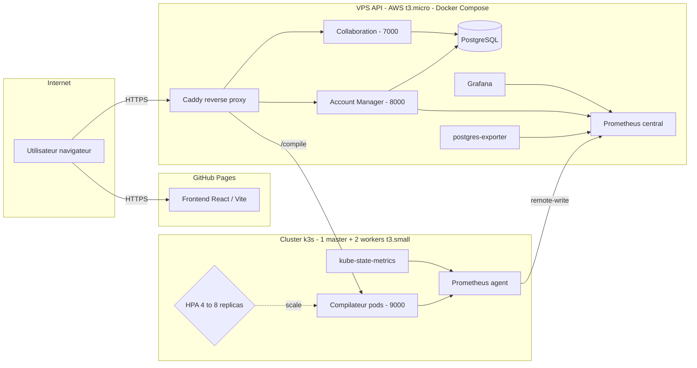

**(Fork pour épingler sur mon profil `blavogiez` - consultez le [dépôt original](https://github.com/OpenLaTeX/openlatex.github.io) pour voir les runs CI/CD originaux)**

**Migration cloud (infra proxmox auto-hébergée) effectuée au Dimanche 10 mai : fonctionnel, plus de tests à venir dans les prochains jours**

# [OpenLaTeX : Éditeur LaTeX Web collaboratif](https://openlatex.github.io)

## Sommaire

- [Informations de développement](#informations-de-développement)
- [Présentation](#présentation)
- [Architecture](#architecture)
- [Cluster Kubernetes et autoscaling](#cluster-kubernetes-et-autoscaling)
- [Collaboration temps réel](#collaboration-temps-réel)
- [Sécurité](#sécurité)
- [Sauvegardes](#sauvegardes)
- [Monitoring](#monitoring)
- [Tests et qualité](#tests-et-qualité)
- [CI/CD](#cicd)
- [Limites](#limites)
- [Installation](#installation)
- [Procédures](#procédures)
- [Remarque personnelle](#remarque-personnelle)
- [Stack technique](#stack-technique)
- [Licence](#licence)

## Informations de développement

**Réalisé par** : Baptiste Lavogiez  
**Contact** :  
- Mail : [baptiste.lavogiez@proton.me](mailto:baptiste.lavogiez@proton.me)  
- Page GitHub : [blavogiez](https://github.com/blavogiez) | [OpenLaTeX (hosting GitHub Pages)](https://github.com/OpenLaTeX)

## Présentation

Ce projet offre un moyen simple de déployer un serveur LaTeX Cloud, permettant d'utiliser LaTeX en ligne.
Il met également à disposition une base de données intégrée pour que les utilisateurs puissent enregistrer et gérer leurs projets d'où qu'ils soient, avec en prime de la collaboration temps réel (à la Google Docs) grâce à Yjs !

La stack permet d'automatiser les déploiements (CI/CD, Ansible), d'observer les métriques de l'application ([voir dashboards Grafana](https://openlatex-api.blavogiez.fr/grafana/dashboards)) et de mieux la maintenir / sécuriser (chiffrement, sauvegarde automatique, reverse proxy...).

L'objectif de ce projet, au-delà de son utilité primaire, est de monter en compétences sur des cas concrets de production, afin de me préparer à ma poursuite d'études et mon alternance. Je me suis particulièrement concentré sur l'aspect **GitOps** (toute l'infra est décrite dans le repo, rien ne passe par la console AWS ou un `kubectl` manuel), **cloud** (setup hybride AWS Paris avec une EC2 pour l'API et un petit cluster k3s pour le compilateur), **sécurité** (sauvegardes chiffrées GPG, compilation sandboxée, rate limiting par IP et par userId, SSH hardening) et **optimisation** (HPA calibré au fil des load tests k6, scrapes Prometheus ajustés selon la criticité du service, image docker multi-stage).

Ce projet est donc une application typique à petite échelle ; du CRUD de comptes / projets (éditeur) et un processus stateless (compilation). C'est le terrain parfait pour pratiquer du DevOps.

## Architecture

L'architecture est entièrement conteneurisée. Au-delà des "outils" (Kubernetes, Prometheus...), elle exploite concrètement des services Node.js, avec chacun un processus Express séparé :

| Service | Port | Rôle | Où ça tourne |
|---|---|---|---|
| Collaboration | 7000 | WebSocket Yjs pour édition temps réel | Docker Compose (VPS API) |
| Account Manager | 8000 | Auth JWT, CRUD projets/fichiers (lien avec PostgreSQL) | Docker Compose (VPS API) |
| Compilateur | 9000 | Compilation LaTeX via `pdflatex` (texlive-full) | Cluster Kubernetes (scalé par HPA) |

**Caddy** fait office de reverse proxy HTTPS devant l'API et sert le frontend statique. Le VPS API (t3.micro) et le cluster k3s (1 master + 2 workers t3.small) tournent tous les deux sur AWS région Paris (`eu-west-3`), provisionnés par Terraform.



De ce fait, aucun port spécifique n'est ouvert au public. Les seuls accès invoqués sont privés.

Le frontend est hébergé sur GitHub Pages et se redéploie depuis la branche `frontend/release`. L'API backend est déployée depuis `backend/release` (ou `global-release`) via Ansible + SSH.

## Cluster Kubernetes et autoscaling

***Petite précision : Kubernetes est probablement surdimensionné pour ce projet. Je l'intègre surtout pour apprendre en situation réelle et mesurer l'impact en performances sur les dashboards Grafana.***

Le compilateur est le seul service sur le cluster parce que c'est celui qui gagne vraiment à être scalé : compilations gourmandes CPU, indépendantes, sans état partagé.

Config HPA ([`infra/kubernetes/latex-compile.yaml`](infra/kubernetes/latex-compile.yaml)) :

- **de 4 à 8 replicas**, cible **80 % CPU utilization**
- `scaleUp` : `stabilizationWindowSeconds: 120`, +1 pod / 60s
- `scaleDown` : `stabilizationWindowSeconds: 300`, -1 pod / 120s

J'ai volontairement mis une fenêtre de stabilisation plus longue au scale-down qu'au scale-up : un pic de compilations passe vite, et je ne veux pas que l'HPA retire des pods juste après un burst pour devoir les recréer 30 secondes plus tard. Mes load tests k6 m'ont aidé à caler ces valeurs en observant les replicas réels dans le dashboard Grafana dédié.

Le master est `tainted` pour interdire les workloads compilateur (sinon ça peut causer un bottleneck sur le master), les workers les accueillent tous.

## Collaboration temps réel

Le service `collab` (port **7000**, [`backend/collab/`](backend/collab/)) est un serveur Node.js WebSocket basé sur **Yjs** + **y-websocket**. Le JWT est validé sur l'upgrade WebSocket avant d'accepter la connexion. L'état Yjs de chaque projet est persisté en `BYTEA` dans la table `yjs_state` de PostgreSQL, ce qui fait qu'un projet survit aux redémarrages du conteneur sans perdre l'historique collaboratif.

Côté client, Yjs se branche sur CodeMirror 6 (c'est un éditeur de code en js similaire à vscode).

## Sécurité

La gestion des informations secrètes est prioritaire :

- La clé JWT est reconstruite depuis les secrets GitHub Actions ([workflow](.github/workflows/main-build-deploy.yml)).
- La clé SSH pour se connecter à l'utilisateur `admin` du VPS est dédiée, pas celle de ma machine.
- SSH hardening + fail2ban pour réduire la surface d'attaque.
- Les secrets n'apparaissent nulle part dans le code ni l'historique git.

**En-têtes HTTP** configurés par Caddy : HSTS, X-Content-Type-Options, X-Frame-Options, Referrer-Policy, Permissions-Policy. Les conteneurs Node.js tournent en utilisateur non-root.

**Compilation sandboxée** ([`backend/compiler/lib/Compiler.js`](backend/compiler/lib/Compiler.js)) :

- `pdflatex -interaction=nonstopmode -no-shell-escape` (pour éviter les injections LaTeX)
- Timeout dur à **30 s**, `maxBuffer` 10 MB
- pas de persistance serveur, tout est effacé après compilation

**Auth** : `bcrypt` (salt rounds 10) pour les mots de passe, JWT pour les sessions.

**Rate limiting** (`express-rate-limit`) :

| Endpoint | Limite |
|---|---|
| Compilations invité (par IP) | 10 / min |
| Compilations utilisateur connecté (par userId JWT) | 30 / min |
| Tentatives d'auth | 15 / 5 min |
| Protection par défaut | 30 / min |

L'endpoint `/metrics` est monté **avant** le middleware de rate limiting pour éviter que Prometheus se fasse bloquer par ses propres scrapes (petit piège rencontré, corrigé).

## Sauvegardes

La base de données est dumpée **trois fois par jour** via cron (2h, 11h et 20h, voir le playbook Ansible [`setup-backup.yml`](ansible/playbooks/setup-backup.yml)). Le pipeline ([`dump_db.sh`](backend/db-save/dump_db.sh)) fait :

1. `pg_dump -Fc` via `docker exec` sur le conteneur postgres
2. Chiffrement **GPG RSA 4096** avec la clé publique, suppression du dump clair
3. Upload vers **Backblaze B2** (`backups/YYYY/MM/…`)
4. Nettoyage local

Rétention : **7 jours en local**, **30 jours sur B2**. En cas d'échec à une étape, un mail de diagnostic (étape échouée, logs, état des conteneurs, espace disque) est envoyé à l'admin via l'API Resend (c'est un service de mail).

Aucune information présente sur le VPS ou sur le cloud storage ne permet de déchiffrer les sauvegardes. Seule la clé privée hors-ligne peut le faire. Un script de test de restauration ([`admin-test-save.sh`](backend/db-save/admin-test-save.sh)) permet de vérifier qu'une sauvegarde est bien exploitable.

> <details>
> <summary>Exemple d'email de notification automatique :</summary>
>
> 
>
> </details>

## Monitoring

Stack de monitoring : **Prometheus** + **Grafana** + **postgres-exporter** (côté VPS API), **Prometheus agent** + **kube-state-metrics** (côté cluster k3s).

Le Prometheus agent du cluster k3s fait du **remote-write** vers le Prometheus central du VPS API. Cela me donne une vue unifiée, sans avoir à exposer le cluster à l'extérieur.

Grafana est accessible publiquement en lecture seule sur [`/grafana/ (cliquer pour voir)`](https://openlatex-api.blavogiez.fr/grafana/dashboards). Dashboards en place :

- **Account Manager** : durées HTTP (p50/p95), débit, mémoire, event loop lag
- **Compilateur** : durée de compilation (p50/p95), débit, taux d'échec utilisateur vs erreur serveur
- **k3s instances** : replicas actuels vs souhaités (HPA min/max visibles), CPU / RAM des pods
- **PostgreSQL** : connexions actives, taille de la base

Scrape intervals : 2 min pour l'API, 15 s sur le compilateur (plus critique). La rétention est de 5 jours (contrainte de stockage/perf sur l'instance t3.micro).

## Tests et qualité

- **Tests unitaires Jest** sur le backend (`backend/tests/`) : auth, permissions de ressources, compilation stateless. Exécutés dans le job CI `code-test`.
- **Tests de charge k6** ([`load-tests/k6/`](load-tests/k6/)) : scénarios par persona (Alice, Bob, Charlie, Grouped) via `all-personas.sh`. Le job `infra-load-tests` déclenche `Grouped` après chaque déploiement réussi (~250 compilations en ~1 min 30) pour vérifier que l'infra tient, y compris que l'HPA scale correctement.


Un secret `TEST_BYPASS_SECRET` permet à k6 de contourner le rate limiting via le header `X-Test-Key` pour que ces tests soient réalistes.

J'adore les tests de charge ; je pense que c'est un excellent moyen de détecter des problèmes en situation extrême. J'ai pu fix beaucoup de problèmes de compilation et rendre l'application plus résiliente à la suite de tests extrêmes. En ayant fait crash l'API au maximum, j'ai appris à la rendre plus robuste.

## CI/CD

Le pipeline principal [`.github/workflows/main-build-deploy.yml`](.github/workflows/main-build-deploy.yml) réalise 6 jobs séquentiels / parallèles :

1. **`code-test`** : `npm ci` + `npm test` (Jest, Node 22).
2. **`detect-changes`** : `dorny/paths-filter` pour ne reconstruire les images que si le code concerné a changé.
3. **`build-compiler`** : build Docker buildx du compilateur, push vers GHCR (seulement si le compilateur a changé). L'image de base `Dockerfile.base` embarque `texlive-full` (~4 GB) et n'est rebuildée que rarement pour garder les builds CI rapides.
4. **`deploy`** : SSH vers `admin@VPS`, Ansible applique `deploy-backend.yml` puis met à jour le cron de backup.
5. **`deploy-k3s`** : récupère le kubeconfig depuis le master, Ansible applique `deploy-k3s-compile.yml` (HPA, Ingress, Prometheus agent, kube-state-metrics).
6. **`infra-load-tests`** : k6 Grouped (~250 compilations) contre l'infra fraîchement déployée.

Branches : `backend/release` (API), `frontend/release` (GitHub Pages), `global-release` (full-stack).

## Limites

Quelques limites pour ne pas saturer la capacité disponible :

- 10 compilations / min pour les invités
- 30 compilations / min pour les utilisateurs connectés
- 5 projets maximum par compte
- 10 Mo maximum par projet
- Rate limiting global contre le spam de requêtes

Les quotas `project_count` (par user) et `total_size` (par projet) sont maintenus automatiquement par des **triggers PostgreSQL** (`trg_project_count`, `trg_project_size`) sur INSERT/DELETE de `projects` et `files`. L'application n'a pas à les calculer, la base garantit l'invariant.

## Installation

Et maintenant, si l'on voulait installer tout ça ?

### Frontend

Vous l'aurez deviné, cette partie est la plus simple. Dans le dossier frontend :

```bash
npm install
npm run dev
```

### Backend

Si l'on devait redéployer l'infrastructure ailleurs, Docker et Terraform couvrent l'essentiel. Le reste, c'est configurer le serveur.

#### Configuration locale

```bash
cd backend
cp .env.example .env
# remplir les variables (voir .env.example)
docker compose up -d
```

Le backend sera accessible sur `http://localhost:8000`.

Si on veut une installation minimale, on peut tout à fait retirer Prometheus / Grafana ou même Kubernetes.

#### Déploiement en production

On va ici partir sur une approche GitOps / Cloud.

**Sur votre machine / repo GitHub :**
- Créer vos secrets ([.env.example](backend/.env.example))
- Les placer dans les secrets de déploiement GitHub Actions
- Générer une paire de clés SSH `github_deploy_key`

**Sur le VPS :**
- Créer un utilisateur `admin`, lui donner les droits sur son `/home`
- Copier `github_deploy_key.pub` dans `admin/.ssh/authorized_keys`

**Provisionner l'infra AWS :**
```bash
cd infra/terraform/aws
terraform init && terraform plan && terraform apply
```

**Déclencher le déploiement :** un push sur `backend/release` lance le workflow CI, qui se connecte en SSH à `admin`, build les images Docker et met à jour Compose + k3s.
Tous les déploiements sont des playbooks Ansible, ainsi ils devraient être assez explicites.

Pour l'exposer publiquement, il faut un DNS. Le DNS actif en démo est gratuit ([afraid.org](https://freedns.afraid.org/)), Caddy fait le pont entre l'IP publique du VPS et le nom de domaine.

## Procédures

J'ai écris quelques procédures pour les principales tâches de maintenance (qui ne seraient pas couvertes par le README) :

- [Sauvegarde de la BDD](procedures/sauvegarde-bdd.md)
- [Restauration d'une BDD](procedures/restaurer-bdd.md)
- [Transition cloud / migration de VPS](procedures/transition-cloud.md)
- [Cluster Kubernetes](procedures/cluster-kubernetes.md)

Que ce soit pour soi-même ou les autres, je pense que c'est toujours un réflexe à prendre que de documenter ce qu'on fait.

## Remarque personnelle

### Pourquoi ai-je fait ce projet ?

Je trouve que LaTeX est génial pour écrire des documents académiques parfaits, mais son gros problème est dans l'installation et l'utilisation. LaTeX s'adresse à des gens qui ne font pas forcément d'informatique (mathématiques, physique), pourtant son installation native requiert une certaine familiarité. C'est d'ailleurs pour ça qu'Overleaf est leader du marché, et de très loin, avec un WYSIWYG attractif.

Il me fallait une façon d'écrire les rapports en cours ou depuis chez moi, donc avec une base de données. Cela permet également, lors d'un travail de groupe, à d'autres personnes de contribuer à un rapport sans être familières avec LaTeX.

### Quelles compétences ai-je apprises ?

La deuxième raison, et la plus importante, ce sont les compétences apprises.

**Node.js et Express** sont aujourd'hui proéminents sur les architectures backend, et je comprends mieux pourquoi : c'est très simple de construire des backends avec du code propre et compréhensible. J'ai pu mettre en place une API REST complète avec des routes structurées, gérer l'authentification JWT, implémenter des middlewares pour la validation et la gestion des erreurs, et surtout comprendre l'architecture asynchrone de Node.js qui est parfaite pour gérer plusieurs compilations LaTeX en parallèle. La gestion des fichiers uploadés, leur traitement et la compilation via des processus système m'ont permis d'approfondir les concepts de streams et de child processes. J'aurais aussi pu le faire avec Spring Boot qui m'intéresse beaucoup, mais ce sera sûrement pour un prochain projet.

**Docker** est incontournable dans un monde dominé par le cloud computing. La conteneurisation permet d'isoler les services, de garantir la reproductibilité des environnements et de simplifier énormément le déploiement. J'ai pu apprendre à orchestrer plusieurs conteneurs avec Docker Compose, gérer les volumes persistants pour la base de données et configurer les réseaux entre conteneurs. C'est particulièrement utile pour ce projet : les trois services Node.js et le conteneur PostgreSQL communiquent ensemble tout en restant isolés, et je peux reconstruire l'infrastructure complète en quelques commandes.

Pour **PostgreSQL**, j'ai déjà pu connaître la partie modélisation / requêtes grâce au BUT Informatique, et j'ai pu ici approfondir la partie Administration / DBA côté serveur. Les triggers auto-maintiennent les quotas (`project_count`, `total_size`) : c'est la base qui garantit l'invariant, pas l'application, et c'est bien plus solide. La **gestion de la sécurité** est un point particulièrement important pour moi et j'ai beaucoup aimé travailler sur le chiffrement et le stockage distant des sauvegardes.

La **CI/CD avec GitHub Actions** est la cerise sur le gâteau. J'ai configuré un workflow en 6 jobs qui se déclenche à chaque push sur la branche de release : tests Jest, détection des changements, build conditionnel des images vers GHCR, déploiement Ansible sur le VPS et sur le cluster k3s, puis tests de charge k6 contre l'infra fraîchement déployée. Orchestrer deux cibles de déploiement (VPS Compose + cluster Kubernetes) depuis un seul commit, avec les secrets gérés proprement et une validation par load test automatique, c'est là où j'ai pris la mesure de ce que le GitOps apporte vraiment. Chaque modification est en production en quelques minutes.

Le **monitoring avec Prometheus et Grafana** m'a introduit à l'observabilité. J'ai instrumenté les services Node.js avec `prom-client` pour exposer des métriques métier (taux d'échec de compilation, p95 des durées) en plus des métriques système. La subtilité était de placer `/metrics` avant les middlewares de rate limiting pour que Prometheus ne se fasse pas bloquer par ses propres scrapes. Le coût de mise en place est faible pour ce que ça apporte en visibilité.

La **migration vers AWS avec Terraform** m'a permis d'aborder l'Infrastructure as Code sérieusement. Plutôt que de configurer les machines à la main, toute l'infrastructure (instance EC2 t3.micro pour l'API, 1 master + 2 workers t3.small pour k3s, security groups, clés SSH, région Paris) est décrite dans des fichiers Terraform versionnés. Recréer l'environnement complet depuis zéro ne demande qu'un `terraform apply`. J'ai aussi découvert des subtilités du cloud AWS (IAM, gestion des régions, tarification) par rapport à un VPS classique chez DigitalOcean.

Le **passage sur Kubernetes (k3s) avec HPA** a été la dernière étape, et sans doute la plus formatrice. Au-delà de l'apprentissage de `kubectl`, des manifests et de l'Ingress Traefik, c'est la mise en place de l'**autoscaling** qui a été révélatrice : calibrer les `requests` / `limits` CPU, choisir des fenêtres de stabilisation pertinentes (120 s au scale-up, 300 s au scale-down pour éviter le thrashing), et surtout utiliser les load tests k6 pour **observer** le comportement réel de l'HPA sur Grafana : c'est là qu'on voit vraiment si la configuration tient ou pas. Le Prometheus agent du cluster qui fait du remote-write vers le Prometheus central du VPS API m'a aussi appris à penser l'observabilité **cross-cluster** sans exposer Kubernetes à l'extérieur.

## Stack technique

| Domaine | Outils |
|---|---|
| **Infrastructure** | Terraform (AWS `eu-west-3`), Ansible, Kubernetes k3s (1 master + 2 workers), HPA, Traefik Ingress, Caddy |
| **Conteneurisation** | Docker, Docker Compose |
| **CI/CD** | GitHub Actions, GHCR |
| **Observabilité** | Prometheus (+ remote-write), Grafana, postgres-exporter, kube-state-metrics |
| **Sécurité & Backups** | GPG RSA 4096, Backblaze B2, fail2ban, SSH hardening |
| **Application** | Node.js 22, Express, JWT, `bcrypt`, `pg`, `prom-client` (backend) · Yjs, y-websocket (temps réel) |
| **Base de données** | PostgreSQL (triggers de quotas, BYTEA pour l'état Yjs) |
| **Tests** | Jest (unitaires backend), Grafana k6 (charge en CI) |

## Licence

Ce projet est open-source et disponible sous licence Apache.
