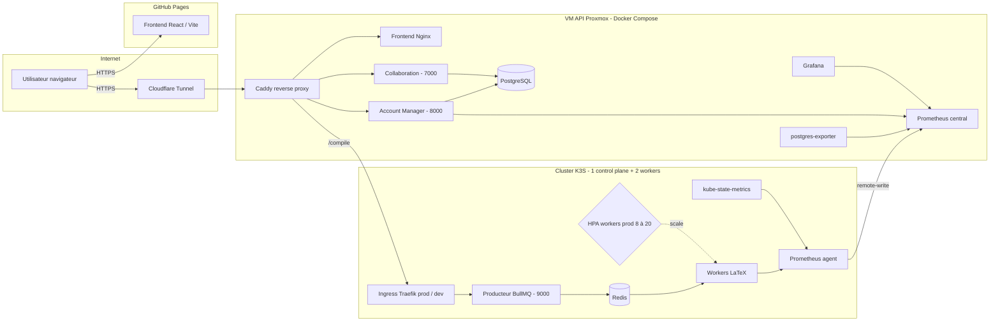
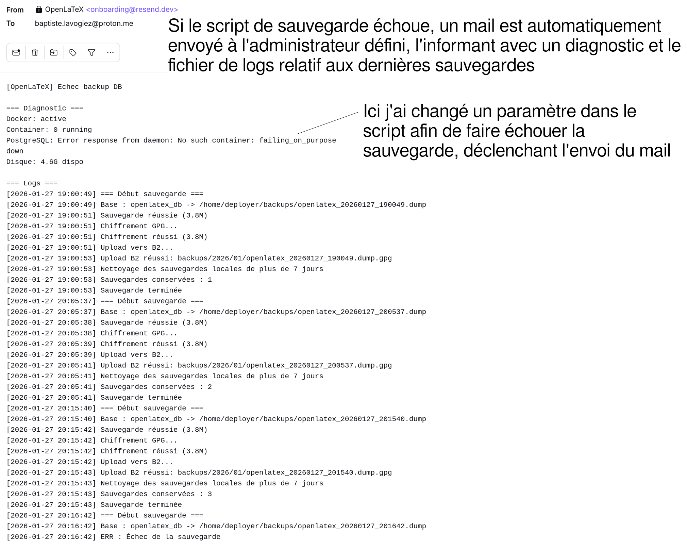

**Fork pour épingler sur le profil `blavogiez` - pour voir les runs CI/CD, consultez le [dépôt original](https://github.com/OpenLaTeX/openlatex.github.io)**

# [OpenLaTeX : Éditeur LaTeX Web collaboratif](https://openlatex.github.io)

## Sommaire

- [Informations de développement](#informations-de-développement)
- [Présentation](#présentation)
- [Architecture](#architecture)
- [Cluster Kubernetes et autoscaling](#cluster-kubernetes-et-autoscaling)
- [Collaboration temps réel](#collaboration-temps-réel)
- [Sécurité](#sécurité)
- [Sauvegardes](#sauvegardes)
- [Monitoring](#monitoring)
- [Tests et qualité](#tests-et-qualité)
- [CI/CD](#cicd)
- [Limites](#limites)
- [Installation](#installation)
- [Procédures](#procédures)
- [Remarque personnelle](#remarque-personnelle)
- [Stack technique](#stack-technique)
- [Licence](#licence)

## Informations de développement

**Réalisé par** : Baptiste Lavogiez  
**Contact** :  
- Mail : [baptiste.lavogiez@proton.me](mailto:baptiste.lavogiez@proton.me)  
- Page GitHub : [blavogiez](https://github.com/blavogiez) | [OpenLaTeX (hosting GitHub Pages)](https://github.com/OpenLaTeX)

## Présentation

Ce projet offre un moyen simple de déployer un serveur LaTeX collaboratif open-source accessible par le Web, permettant d'utiliser LaTeX depuis un navigateur.
Il met également à disposition une base de données intégrée pour que les utilisateurs puissent enregistrer et gérer leurs projets d'où qu'ils soient, et collaborer en temps réel sur un même document grâce à Yjs !

La stack permet d'automatiser les déploiements (CI/CD, Ansible, Helm), d'observer les métriques de l'application ([voir les dashboards Grafana, avec namespace prod / dev](https://openlatex.blavogiez.fr/grafana/dashboards)) et de mieux la maintenir / sécuriser (chiffrement, sauvegardes automatiques, isolation réseau...).

L'objectif de ce projet, au-delà de son utilité primaire, est de monter en compétences sur des cas concrets de production, afin de me préparer à ma poursuite d'études et mon alternance. Je me suis particulièrement concentré sur l'aspect **Git | CI/CD** (l'infrastructure et les déploiements sont décrits et dans le dépôt et automatisés), **Infrastructure as Code** (VM Proxmox provisionnées par Terraform et K3S installé par cloud-init), **sécurité** (sauvegardes chiffrées GPG, compilation durcie, rate limiting et isolation réseau) et **optimisation** (HPA calibré grâce aux tests de charge k6 et métriques Prometheus).

Ce projet est donc une application typique à petite échelle ; du CRUD de comptes / projets (éditeur) et un processus stateless (compilation). C'est le terrain parfait pour pratiquer du DevOps.

## Architecture

L'architecture est entièrement conteneurisée. Au-delà des « outils » (Kubernetes, Prometheus...), elle s'organise autour de trois briques applicatives. La compilation est elle-même séparée en deux processus Node.js : un producteur HTTP et des workers BullMQ :

| Service | Port | Rôle | Où ça tourne |
|---|---|---|---|
| Collaboration | 7000 | WebSocket Yjs pour l'édition temps réel | Docker Compose (VM API) |
| Account Manager | 8000 | Auth JWT, CRUD projets/fichiers et PostgreSQL | Docker Compose (VM API) |
| Compilateur | 9000 | Producteur BullMQ, file Redis et workers `pdflatex` | Cluster K3S (workers scalés par HPA) |

**Caddy** fait office de reverse proxy : il route les requêtes vers le frontend servi par son conteneur Nginx, l'API de comptes, le WebSocket de collaboration, Grafana et l'Ingress Kubernetes. L'infrastructure actuelle tourne sur **4 VM Debian hébergées par Proxmox** : une VM centrale pour Docker Compose et un cluster K3S composé d'un control plane et de deux workers. Les VM sont décrites avec Terraform ; au cloud-init, les nœuds installent K3S et rejoignent automatiquement le cluster.

L'infrastructure a d'abord été hébergée sur AWS avec des instances EC2, ce qui m'a permis d'utiliser les crédits gratuits pour apprendre à gérer une petite infrastructure cloud. Une fois ces crédits consommés, je suis passé à un hébergement local Proxmox, beaucoup moins cher sur le long terme. Cette migration a aussi donné lieu à un projet plus large d'infrastructure Proxmox décrite dans Git et auto-déployée : [proxmox-gitops](https://github.com/jobacogiez-org/proxmox-gitops).



L'infrastructure se trouve sur un réseau isolé et n'est pas directement exposée au réseau public. Un **Cloudflare Tunnel** atteint un reverse proxy central, qui redirige ensuite vers la VM OpenLaTeX et ses services internes. À distance, l'administration passe par le VPN de l'hyperviseur Proxmox.

Le frontend peut être servi de deux façons : par GitHub Pages sur `openlatex.github.io`, ou par le conteneur Nginx de la VM API derrière Caddy sur les domaines `openlatex.blavogiez.fr`. Pour le backend, la branche `main` déploie l'environnement `openlatex-prod`, accessible sur [openlatex.blavogiez.fr](https://openlatex.blavogiez.fr) ; les autres branches suivies par le workflow utilisent `openlatex-dev`, accessible sur [openlatex-dev.blavogiez.fr](https://openlatex-dev.blavogiez.fr). Il s'agit de l'URL du backend que contactera le front de l'application ; elle est donc paramétrable. Chaque namespace dispose ainsi de sa propre URL d'Ingress, ce qui permet de tester une version sans remplacer la production. Par ailleurs, les métriques et Dashboards Grafana sont consultables par namespace.


## Cluster Kubernetes et autoscaling

***Petite précision : Kubernetes est probablement surdimensionné pour ce projet. Je l'intègre surtout pour apprendre en situation réelle et mesurer l'impact en performances sur les dashboards Grafana.***

Le compilateur est le seul service applicatif sur le cluster parce que c'est celui qui gagne vraiment à être scalé : les compilations sont gourmandes en CPU, indépendantes et sans état partagé. L'API de compilation ajoute les tâches à une file **BullMQ**, stockée dans **Redis**, puis les workers disponibles les consomment. L'HPA ne scale que ces workers ; le producteur et Redis gardent chacun une replica.

Le chart Helm configure deux environnements :

- **production** : namespace `openlatex-prod`, URL [openlatex.blavogiez.fr](https://openlatex.blavogiez.fr), de **8 à 20 workers**
- **développement** : namespace `openlatex-dev`, URL [openlatex-dev.blavogiez.fr](https://openlatex-dev.blavogiez.fr), de **2 à 8 workers**


- cible commune : **50 % CPU utilization**
- `scaleUp` : `stabilizationWindowSeconds: 120`, jusqu'à +3 pods / 60s
- `scaleDown` : `stabilizationWindowSeconds: 600`, jusqu'à -2 pods / 240s

J'ai volontairement mis une fenêtre de stabilisation plus longue au scale-down qu'au scale-up : un pic de compilations passe vite, et je ne veux pas que l'HPA retire des pods juste après un burst pour devoir les recréer peu après. Mes load tests k6 m'ont aidé à caler ces valeurs en observant les replicas réels dans le dashboard Grafana dédié.

Le control plane est `tainted` pour interdire les workloads compilateur (sinon cela peut créer un bottleneck sur le nœud qui administre le cluster), les workers les accueillent tous. Des **NetworkPolicy** limitent les communications : le producteur et les workers peuvent joindre Redis, mais les composants de compilation n'ont pas un accès libre au reste du réseau.

Vue d'ensemble : 


## Collaboration temps réel

Le service `collab` (port **7000**, [`backend/collab-websocket/`](backend/collab-websocket/)) est un serveur Node.js WebSocket basé sur **Yjs** + **y-websocket**. Le JWT et l'accès au projet sont vérifiés pendant l'upgrade WebSocket avant d'accepter la connexion.

À l'ouverture d'un projet, le service initialise le document Yjs à partir des fichiers stockés dans PostgreSQL. L'état collaboratif Yjs n'est en revanche pas persisté directement : `writeState` est actuellement vide et il n'existe pas de table `yjs_state`. Les fichiers enregistrés survivent donc aux redémarrages, mais pas l'historique interne du document Yjs.

Côté client, Yjs se branche sur CodeMirror 6 (c'est un éditeur de code en JS similaire à VS Code).

## Sécurité

La gestion des informations secrètes est prioritaire :

- la clé JWT et la clé SSH de déploiement sont injectées depuis les secrets GitHub Actions ([workflow](.github/workflows/main-build-deploy.yml))
- la clé SSH utilisée par la CI est dédiée au déploiement
- les conteneurs Node.js tournent avec un utilisateur non-root
- les `NetworkPolicy` Kubernetes limitent les communications entre le producteur, Redis et les workers

Caddy assure ici le routage HTTP interne. Le HTTPS public et les protections placées devant l'application dépendent du Cloudflare Tunnel et du reverse proxy central.

**Compilation durcie** ([`backend/compiler/queue-worker/lib/Compiler.js`](backend/compiler/queue-worker/lib/Compiler.js)) :

- `pdflatex -interaction=nonstopmode -no-shell-escape`
- validation du chemin et du nom du fichier principal
- timeout dur à **30 s** et `maxBuffer` de 10 Mio
- exécution dans un répertoire temporaire supprimé après la compilation, qu'elle réussisse ou échoue
- suppression immédiate des jobs BullMQ réussis ; les jobs échoués restent au maximum **1 heure** dans Redis pour diagnostic

**Auth** : `bcrypt` (salt rounds 10) pour les mots de passe, JWT pour les sessions.

**Rate limiting** (`express-rate-limit`) :

| Endpoint | Limite réellement appliquée |
|---|---|
| Compilations | 10 / min par IP |
| Tentatives d'auth | 15 / 5 min par IP |
| Protection par défaut des API HTTP | 30 / min par IP |

Le serveur WebSocket de collaboration n'est pas couvert par ces limiteurs Express. L'endpoint `/metrics` est monté **avant** le middleware de rate limiting pour éviter que Prometheus se fasse bloquer par ses propres scrapes.

## Sauvegardes

La base de données est dumpée **trois fois par jour** via cron (2h, 11h et 20h, voir le playbook Ansible [`setup-backup.yml`](infra/ansible/playbooks/setup-backup.yml)). Le pipeline ([`dump_db.sh`](backend/cron/db-save/dump_db.sh)) fait :

1. `pg_dump -Fc` via `docker exec` sur le conteneur PostgreSQL
2. chiffrement GPG avec la clé publique importée, puis suppression du dump clair
3. upload vers **Backblaze B2** (`backups/YYYY/MM/…`)
4. nettoyage local

La rétention locale appliquée par le script est de **7 jours**. Le script déclare une rétention distante de 30 jours, mais ne l'applique pas lui-même : cette durée doit être configurée avec une règle de cycle de vie Backblaze B2.

En cas d'échec détecté, le script tente d'envoyer un mail de diagnostic via l'API Resend. La VM n'importe que la clé publique GPG ; le déchiffrement nécessite la clé privée correspondante, qui n'est pas déployée par le playbook. Un script de test de restauration ([`admin-test-save.sh`](backend/cron/db-save/admin-test-save.sh)) permet de vérifier qu'une sauvegarde est exploitable.

> <details>
> <summary>Exemple d'email de notification automatique :</summary>
>
> 
>
> </details>

## Monitoring

Stack de monitoring : **Prometheus** + **Grafana** + **postgres-exporter** (côté VM API), **Prometheus agent** + **kube-state-metrics** (côté cluster K3S).

Le Prometheus agent du cluster K3S fait du **remote-write** vers le Prometheus central de la VM API. Cela me donne une vue unifiée, sans avoir à exposer le cluster à l'extérieur.

Grafana est accessible publiquement en lecture seule sur [openlatex.blavogiez.fr/grafana/dashboards](https://openlatex.blavogiez.fr/grafana/dashboards). Les dashboards Kubernetes et compilateur permettent de sélectionner le namespace `openlatex-prod` ou `openlatex-dev`. Dashboards en place :

- **Account Manager** : durées HTTP (p50/p95), débit, mémoire, event loop lag
- **Compilateur** : durée de compilation (p50/p95), débit, erreurs et profondeur de la file Redis
- **K3S instances** : replicas actuels vs souhaités (HPA min/max visibles), CPU / RAM et redémarrages des pods
- **PostgreSQL** : connexions actives, taille de la base

Des tests de charge k6 sont lancés automatiquement dans la CI/CD après les déploiements, et également en cronjob en permanence afin d'entretenir les métriques et vérifier le comportement réel de l'infrastructure (= la mettre à l'épreuve pour voir comment je peux l'améliorer). Les intervalles de scrape sont adaptés à la criticité des services et la rétention reste volontairement courte pour limiter le stockage nécessaire sur la VM.

## Tests et qualité

- **Tests unitaires Jest** sur le backend (`backend/tests/`) : auth, permissions de ressources, compilation stateless. Exécutés dans le job CI `code-test`.
- **Tests de charge k6** ([`infra/load-tests/k6/`](infra/load-tests/k6/)) : scénarios par persona (Alice, Bob, Charlie, Grouped) via `all-personas.sh`. Le job CI/CD `infra-load-tests` déclenche `Grouped` après chaque déploiement réussi (~250 compilations en ~1 min 30) pour vérifier que l'infrastructure tient, y compris que l'HPA scale correctement.

Un secret `TEST_BYPASS_SECRET` permet à k6 de contourner le rate limiting via le header `X-Test-Key` pour que ces tests soient réalistes.

J'adore les tests de charge ; je pense que c'est un excellent moyen de détecter des problèmes en situation extrême. J'ai pu corriger beaucoup de problèmes de compilation et rendre l'application plus résiliente après avoir volontairement poussé l'API dans ses limites.

## CI/CD

Le pipeline principal [`.github/workflows/main-build-deploy.yml`](.github/workflows/main-build-deploy.yml) enchaîne les jobs suivants :

1. **`code-test`** : `npm ci` + `npm test` (Jest, Node 22).
2. **`detect-changes`** : `dorny/paths-filter` pour ne reconstruire les images que si le code concerné a changé.
3. **`build-compiler`** et **`build-queue-producer`** : builds Docker séparés des workers LaTeX et du producteur BullMQ, puis push vers GHCR.
4. **`deploy`** : Ansible redéploie les services Docker Compose et met à jour les sauvegardes sur la VM API.
5. **`deploy-k3s`** : récupération du kubeconfig, puis déploiement du chart Helm avec le namespace correspondant à la branche.
6. **`infra-load-tests`** : scénario k6 Grouped (~250 compilations) contre l'infrastructure fraîchement déployée.

La branche `main` cible `openlatex-prod` et [openlatex.blavogiez.fr](https://openlatex.blavogiez.fr). Toutes les autres branches ciblent `openlatex-dev` et [openlatex-dev.blavogiez.fr](https://openlatex-dev.blavogiez.fr). On obtient ainsi un environnement / namespace différent selon la branche Git, sans commandes `kubectl` manuelles.

## Limites

Quelques limites pour ne pas saturer la capacité disponible :

- 10 compilations / min par IP
- 30 requêtes HTTP / min par IP sur la protection par défaut des API
- 15 tentatives d'authentification / 5 min par IP
- 5 projets maximum par compte
- 10 Mio maximum par projet

Les compilations ne disposent pas encore d'une limite différente pour un utilisateur authentifié. Le rate limiting Express ne couvre pas les connexions WebSocket de collaboration.

Les quotas sont garantis par PostgreSQL : `project_count` est mis à jour par `trg_project_count` lors des insertions et suppressions de projets ; `total_size` est mis à jour par `trg_project_size` lors des insertions, modifications et suppressions de fichiers.

## Installation

Et maintenant, si l'on voulait installer tout ça ?

### Frontend

Vous l'aurez deviné, cette partie est la plus simple. Dans le dossier frontend :

```bash
npm install
npm run dev
```

### Backend

Si l'on devait redéployer l'infrastructure ailleurs, Docker et Terraform couvrent l'essentiel. Le reste, c'est configurer le serveur.

#### Configuration locale

```bash
cd deploy/compose
cp .env.example .env
# remplir les variables (voir .env.example)
docker compose up -d
```

Cette configuration démarre PostgreSQL, le frontend Nginx, l'Account Manager, le service de collaboration, Caddy et le monitoring. Elle ne publie pas directement le port 8000 : seuls les ports 80 et 443 de Caddy sont exposés. Le `Caddyfile` fourni cible les domaines de déploiement et doit donc être adapté pour utiliser `localhost`.

La stack Compose ne contient pas Redis, le producteur BullMQ ni les workers LaTeX ; la compilation complète nécessite le chart Kubernetes. Ce n'est donc pas encore une installation locale autonome de toute la plateforme.

#### Déploiement en production

On va ici partir sur une approche GitOps / Infrastructure as Code.

**Sur votre machine / repo GitHub :**

- créer les secrets applicatifs ([`.env.example`](deploy/compose/.env.example)) et les placer dans les secrets GitHub Actions
- générer une paire de clés SSH `github_deploy_key`
- renseigner les variables Terraform du provider Proxmox

**Provisionner les VM Proxmox :**

```bash
cd infra/terraform/proxmox
terraform init
terraform plan
terraform apply
```

Terraform crée la VM API, le control plane et les deux workers. Les scripts cloud-init installent K3S, appliquent le `taint` du control plane et font rejoindre automatiquement les workers au cluster.

**Déclencher le déploiement :** un push sur `main` lance le déploiement de production ; un push sur n'importe quelle autre branche alimente l'environnement de développement. Ansible met à jour Docker Compose sur la VM API et déploie le chart Helm dans `openlatex-prod` ou `openlatex-dev`.

L'infrastructure n'étant pas exposée directement au réseau public, l'accès Web passe par un Cloudflare Tunnel et le reverse proxy central. Les anciens fichiers Terraform AWS restent présents dans le dépôt comme historique de la première infrastructure, mais Proxmox est désormais la cible active.

## Procédures

J'ai écrit quelques procédures pour les principales tâches de maintenance (qui ne seraient pas couvertes par le README) :

- [Sauvegarde de la BDD](docs/procedures/sauvegarde-bdd.md)
- [Restauration d'une BDD](docs/procedures/restaurer-bdd.md)
- [Transition cloud / migration de VPS](docs/procedures/transition-cloud.md)

Que ce soit pour soi-même ou les autres, je pense que c'est toujours un réflexe à prendre que de documenter ce qu'on fait.

## Remarque personnelle

### Pourquoi ai-je fait ce projet ?

Je trouve que LaTeX est génial pour écrire des documents académiques parfaits, mais son gros problème est dans l'installation et l'utilisation. LaTeX s'adresse à des gens qui ne font pas forcément d'informatique (mathématiques, physique), pourtant son installation native requiert une certaine familiarité. C'est d'ailleurs pour ça qu'Overleaf est leader du marché, et de très loin, avec un WYSIWYG attractif.

Il me fallait une façon d'écrire les rapports en cours ou depuis chez moi, donc avec une base de données. Cela permet également, lors d'un travail de groupe, à d'autres personnes de contribuer à un rapport sans être familières avec LaTeX.

Mais par dessus tout, c'était surtout un bon moyen d'apprendre une stack sur un cas pratique qui m'a accompagné pendant plusieurs mois. À chaque fois que je veux appliquer un composant ou paradigme de développement j'ai juste à l'implémenter dans l'application. 

Je me suis surtout concentré sur la partie Infrastructure, je n'ai pas beaucoup de temps et je préfère passer du temps dessus plutôt que le Front par exemple. Cela correspond mieux à mon parcours professionnel cible.

## Stack technique

| Domaine | Outils |
|---|---|
| **Infrastructure** | Terraform (provider Proxmox), Ansible, Kubernetes (1 control plane + 2 workers), Helm, HPA, Traefik Ingress, Caddy |
| **Conteneurisation** | Docker, Docker Compose |
| **CI/CD** | GitHub Actions, GHCR, environnements / namespaces prod et dev |
| **Observabilité** | Prometheus (+ remote-write), Grafana, postgres-exporter, kube-state-metrics |
| **Sécurité & Backups** | Cloudflare Tunnel, NetworkPolicy, conteneurs non-root, chiffrement GPG, Backblaze B2 |
| **Application** | Node.js 22, Express, BullMQ, Redis, JWT, `bcrypt`, `pg`, `prom-client` · Yjs, y-websocket |
| **Base de données** | PostgreSQL (triggers de quotas, BYTEA pour le contenu des fichiers) |
| **Tests** | Jest (unitaires backend), Grafana k6 (charge en CI) |

## Licence

Ce projet est open-source et disponible sous licence Apache.
