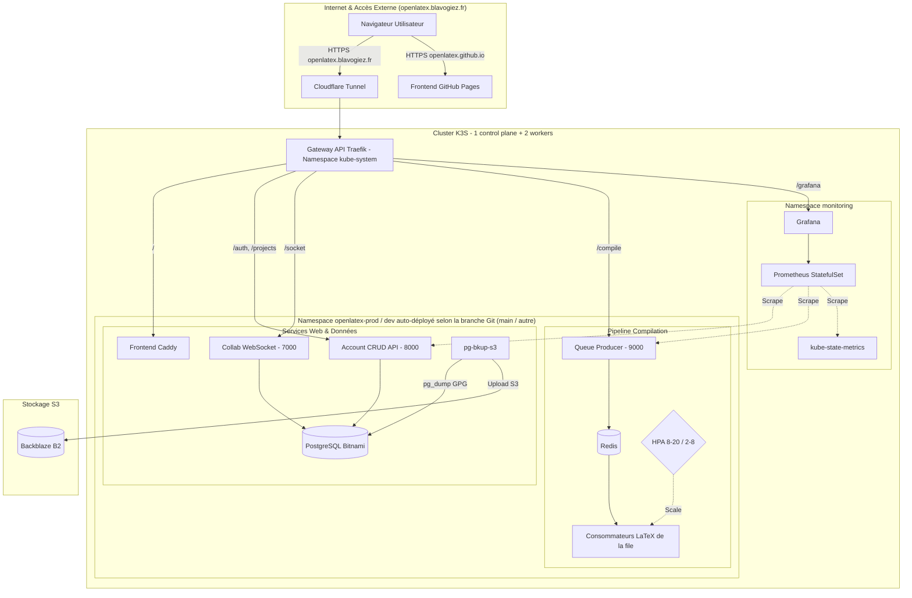
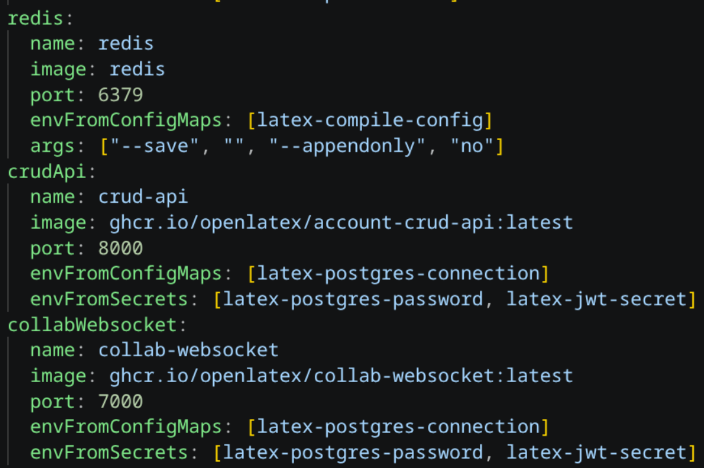
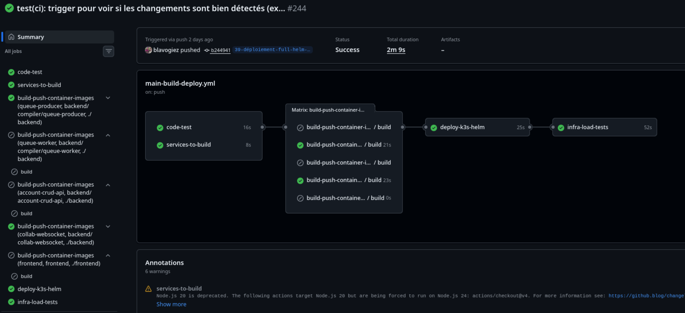

# [openlatex.github.io : Éditeur LaTeX Web collaboratif](https://openlatex.github.io)

## Informations de développement

**Réalisé par** : Baptiste Lavogiez  
**Liens** :  
- Mail : [baptiste.lavogiez@proton.me](mailto:baptiste.lavogiez@proton.me)  
- Page GitHub : [blavogiez](https://github.com/blavogiez) | [OpenLaTeX (hosting GitHub Pages)](https://github.com/OpenLaTeX)
- Hébergé sur [mon infra proxmox](https://github.com/blavogiez-org/proxmox-configuration) sur Kubernetes, auto-déployé et accessible sur [openlatex.blavogiez.fr](https://openlatex.blavogiez.fr) 

## Sommaire

- [Présentation et objectifs](#présentation-et-objectifs)
- [Installation rapide](#installation-rapide)
  - [1. Déploiement basique (Compose standalone en 1 ligne)](#1-déploiement-basique-compose-standalone-en-1-ligne)
  - [2. Déploiement avancé (Cluster Kubernetes & Helm)](#2-déploiement-avancé-cluster-kubernetes--helm)
- [Architecture Kubernetes en situation](#architecture-kubernetes-en-situation)
- [Cluster Kubernetes et autoscaling](#cluster-kubernetes-et-autoscaling)
- [Collaboration temps réel](#collaboration-temps-réel)
- [Sécurité & Réseau](#sécurité--réseau)


## Présentation et objectifs

Ce projet permet de déployer un serveur LaTeX collaboratif open-source accessible par le Web, avec une base de données intégrée pour gérer ses projets et collaborer en temps réel sur un même document grâce à Yjs.

Au niveau technique, la stack automatise les déploiements (CI/CD GitHub Actions, Ansible, Helm), observe les métriques de l'application ([dashboards Grafana par namespace](https://openlatex.blavogiez.fr/grafana/dashboards)) et durcit l'infrastructure (chiffrement GPG, sauvegardes automatiques S3, hardening NetworkPolicies, compilation isolée et rate limiting).

L'objectif est de monter en compétences sur des cas concrets : **Git / CI/CD** (auto-déploiement, matrix builds sélectifs), **Infrastructure as Code** (Terraform pour Proxmox, cloud-init pour K3S), et surtout **Kubernetes / Helm** (conception de l'architecture découpée et scalable, HPA, déploiement automatisé par namespace selon branche, sécurisation NetworkPolicies) et **observabilité** (Prometheus & Grafana).

***je précise que l'utilisation de Kubernetes est probablement over-engineer pour ce projet, et c'est intentionnel car je voulais à travers ce projet pouvoir m'entrainer au déploiement d'applications typiques (du CRUD, des files de jobs, du backup, de la gateway api, du hardening...) sur Kubernetes. L'installation compose suffit pour la majorité des cas.***

## Installation rapide

### 1. Déploiement basique (Compose standalone en 1 ligne)

Un petit `curl | sh` (en regardant le script avant bien sur ! ) va installer une version sans Kubernetes qui embarque tous les composants dans Docker Compose (frontend, API, compilateur standalone, PostgreSQL, monitoring) ([`docker-compose.full-standalone.yml`](deploy/compose/docker-compose.full-standalone.yml)). Pour une utilisation basique ca convient très bien. Meme si in fine je déploie toujours sur la version Kubernetes, j'utilise ce compose pour tester les changements en local avec le [Makefile](Makefile) qui va avec 

```bash
curl -fsSL https://raw.githubusercontent.com/OpenLaTeX/openlatex.github.io/refs/heads/main/deploy/curl/install-compose-standalone.sh | sh
```

j'ai mis une version de démonstration qui tourne sur [openlatex-compose-only.blavogiez.fr](https://openlatex-compose-only.blavogiez.fr) ( et conséquemment elle a ses [dashboards Grafana associés](https://openlatex-compose-only.blavogiez.fr/grafana/dashboards)).

---

### 2. Déploiement avancé (Cluster Kubernetes & Helm)

Je déploie tout en Kubernetes (le site principal tourne entièrement dessus) en utilisant assez fortement le templating Helm ([`deploy/kubernetes/charts/openlatex/`](deploy/kubernetes/charts/openlatex/)).
Pour cela j'ai 3 vm qui tournent sur [mon Proxmox](https://github.com/blavogiez-org/proxmox-configuration) et qui sont décrites par [Terraform (BPG Provider)](infra/terraform/). Le cluster se crée au cloud init
> <details>
> quand j'aurai fait un peu plus d'administration de cluster kubernetes standard, je mettrai peut etre le fameux Talos linux 
> </details>

Pour le moment c'est en playbook Ansible ([`deploy-helm-chart.yml`](infra/ansible/playbooks/deploy-helm-chart.yml)) pour aller rapidement. Je vais bientot essayer ArgoCD pour voir si ça peut etre plus pratique

```bash
export KUBECONFIG=~/.kube/config
ansible-playbook infra/ansible/playbooks/deploy-helm-chart.yml -e "target_namespace=openlatex-prod"
```

Les déploiements sont entièrement automatisés dans la CI/CD et séparés par environnement : un push sur `main` déploie le namespace `openlatex-prod` ([openlatex.blavogiez.fr](https://openlatex.blavogiez.fr)) et les autres branches déploient `openlatex-dev` ([openlatex-dev.blavogiez.fr](https://openlatex-dev.blavogiez.fr)).

## Architecture Kubernetes en situation

L'architecture est entièrement conteneurisée (conteneurs construits + push selon changements par [CI/CD](#cicd)) et déployée sous forme de microservices sur le cluster Kubernetes K3S :

| Service | Port | Rôle | Déploiement |
|---|---|---|---|
| Frontend | 80 | Interface web servie par Caddy | Pod K3S (ou GitHub Pages) |
| Account Manager | 8000 | Auth JWT, CRUD projets/fichiers | Pod K3S (`account-crud-api`) |
| Collaboration | 7000 | WebSocket Yjs pour l'édition temps réel | Pod K3S (`collab-websocket`) |
| Queue Producer | 9000 | Réception HTTP des compilations et push file BullMQ | Pod K3S (`queue-producer`) |
| Queue Worker | - | Workers `pdflatex` consommant file BullMQ | Pods K3S scalés par HPA (`queue-worker`) |
| Bdd PostgreSQL | 5432 | Stockage des comptes, projets et fichiers | Pod K3S (subchart Bitnami PostgreSQL) |
| Redis (Intermédiaire de file) | 6379 | File d'attente des compilations pour BullMQ | Pod K3S (`redis`) |
| Sauvegardes | - | copies PostgreSQL chiffrés GPG vers endpoint S3 compatible | Pod K3S (`pg-bkup-s3`) |
| Monitoring | 9090 / 3000 | Prometheus StatefulSet & Grafana | Namespace `monitoring` |


```mermaid
flowchart TD
    subgraph Internet["Internet & Accès Externe (openlatex.blavogiez.fr)"]
      U[Navigateur Utilisateur] -->|HTTPS openlatex.blavogiez.fr| Tunnel[Cloudflare Tunnel]
      U -->|HTTPS openlatex.github.io| FEPages[Frontend GitHub Pages]
    end

    subgraph K3S[Cluster K3S - 1 control plane + 2 workers]
      Gateway[Gateway API Traefik - Namespace kube-system]

      subgraph AppNS["Namespace openlatex-prod / dev auto-déployé selon la branche Git (main / autre)"]
        subgraph WebServices[Services Web & Données]
          FE[Frontend Caddy]
          AM[Account CRUD API - 8000]
          Collab[Collab WebSocket - 7000]
          PG[(PostgreSQL Bitnami)]
          Bkup[pg-bkup-s3]
          
          AM --> PG
          Collab --> PG
          Bkup -->|pg_dump GPG| PG
        end

        subgraph CompilePipeline[Pipeline Compilation]
          Producer[Queue Producer - 9000]
          Redis[(Redis)]
          Comp[Consommateurs LaTeX de la file]
          HPA{HPA 8-20 / 2-8}

          Producer --> Redis --> Comp
          HPA -.->|Scale| Comp
        end
      end

      subgraph MonitoringNS[Namespace monitoring]
        Graf[Grafana] --> Prom[Prometheus StatefulSet]
        KSM[kube-state-metrics]
      end
    end

    subgraph Storage[Stockage S3]
      B2[(Backblaze B2)]
    end

    %% Connexion externe vers K3S
    Tunnel --> Gateway

    %% Routage Gateway API
    Gateway -->|/| FE
    Gateway -->|/auth, /projects| AM
    Gateway -->|/socket| Collab
    Gateway -->|/compile| Producer
    Gateway -->|/grafana| Graf

    %% Sauvegardes
    Bkup -->|Upload S3| B2

    %% Métriques
    Prom -.->|Scrape| AM
    Prom -.->|Scrape| Producer
    Prom -.->|Scrape| KSM
```

L'infrastructure est isolée du réseau public : l'accès Web passe par un **Cloudflare Tunnel** qui contacte la **Gateway API Kubernetes** (Traefik `Gateway` & `HTTPRoute`) du cluster K3S. Pour les échanges internes ils sont limités au strict minimum avec une network policy de default deny et autorisations ciblées. L'administration à distance s'effectue via le VPN wireguard que j'ai mis sur proxmox.

## Cluster Kubernetes et autoscaling

Le chart Helm `openlatex` factorise tous les deployments via un contrat de template commun dans `values.yaml`. j'ai voulu faire au plus simple en faisant le contrat minimal pour les besoins de l'app.

Petit extrait : 


Il y a qq changements selon l'environnement (`values-prod.yaml` et `values-dev.yaml`) :

- **production** (`openlatex-prod`) : [openlatex.blavogiez.fr](https://openlatex.blavogiez.fr), de **8 à 20 workers**
- **développement** (`openlatex-dev`) : [openlatex-dev.blavogiez.fr](https://openlatex-dev.blavogiez.fr), de **2 à 8 workers**, et sauvegarde S3 désactivée


- **Autoscaling (HPA)** : cible **50 % CPU utilization**
  - `scaleUp` : `stabilizationWindowSeconds: 120`, jusqu'à +3 pods / 60s
  - `scaleDown` : `stabilizationWindowSeconds: 600`, jusqu'à -2 pods / 240s

  L'autoscaling est un peu forcé (En réalité si je mets des grosses limites au compilateur ça peut faire quasiment pareil en performances), je l'ai surtout mis pour apprendre à en manipuler un, voir qq subtilités, et concevoir une architecture scalable (La gestion de file découplée en un producteur / consommateur et intermédiaire) 

- Le control plane est `tainted` 

## Collaboration temps réel

Le service `collab-websocket` (port **7000**, [`backend/collab-websocket/`](backend/collab-websocket/)) est un serveur Node.js WebSocket basé sur **Yjs** + **y-websocket**. Le token JWT et les permissions d'accès au projet sont vérifiés lors de la négociation WebSocket. À l'ouverture d'un projet, le document Yjs est initialisé à partir des fichiers présents dans PostgreSQL et se synchronise côté client avec CodeMirror 6.

## Sécurité & Réseau

- **NetworkPolicies Kubernetes** ([`default-networking.yaml`](deploy/kubernetes/charts/openlatex/templates/default-networking.yaml), [`networking.yaml`](deploy/kubernetes/charts/openlatex/templates/networking.yaml)) :
  - Politique *Default Deny* (tt ingress egress bloqué, sauf ingress traefik kube system et egress CoreDNS)
  - Ingress PostgreSQL restreint aux seuls pods autorisés (`account-crud-api`, `collab-websocket`, `pg-bkup`).
  - Ingress Prometheus restreint aux endpoints de scraping (`queue-producer`, `account-crud-api`).
- **Contextes de sécurité** : conteneurs exécutés avec un utilisateur non-root standardisé (`UID 10000`).
<details>
pour aller plus loin je vais regarder pour mettre un runtime de conteneurs plus isolé comme Kata
</details>


- **Compilation temporaire** ([`backend/compiler/queue-worker/lib/Compiler.js`](backend/compiler/queue-worker/lib/Compiler.js)) :
  - `pdflatex -interaction=nonstopmode -no-shell-escape`
  - Timeout dur à **30 s**, `maxBuffer` 10 Mio, exécution en dossier temporaire supprimé après compilation.
- **Auth & Rate limiting** : les mots de passe hachés avec `bcrypt` (10 rounds), sessions JWT. le rate limiting est appliqué par `express-rate-limit` (10 compilations/min, 15 auth/5 min, 30 requêtes API/min).

## Sauvegardes

Les sauvegardes de la base PostgreSQL sont automatisées dans les deux versions par [pg-bkup](https://github.com/jkaninda/pg-bkup).
C'est un tool qui va droit au but, un conteneur avec ses variables d'environnement (dont sa cron expression), que j'ai pris pour faire au plus simple

## Monitoring

La stack de monitoring est déployée dans le namespace dédié `monitoring` via son propre chart Helm :

- **Prometheus** déployé en **StatefulSet** avec stockage persistant pour conserver l'historique des métriques.
- **kube-state-metrics** pour la visibilité des ressources et replicas k3s
- **Grafana** exposé publiquement en lecture seule sur [openlatex.blavogiez.fr/grafana/dashboards](https://openlatex.blavogiez.fr/grafana/dashboards) avec dashboards paramétrés par namespace (`openlatex-prod` / `openlatex-dev`) :
  - **Account Manager crud api** : temps de réponse HTTP (p50/p95), débit, mémoire, lag event loop.
  - **Compilateur & K3S** : temps de compilation, profondeur file Redis, réplicas réels vs HPA min/max, CPU / RAM pods.
  - **PostgreSQL & Sauvegardes** : connexions, taille DB, taux de succès des sauvegardes des utilisateurs.


Pour entretenir les métriques et surveiller l'application et son comportement sous charge, des tests de charge k6 aléatoire sont effectués en continu par cronjob.  

## Tests

- **Tests unitaires Jest** backend (`backend/tests/`) : auth, permissions, compilation stateless (exécutés dans le job CI `code-test`).
- **Tests de charge Grafana k6** ([`infra/load-tests/k6/`](infra/load-tests/k6/)) : scénarios multi-personas. Le job CI `infra-load-tests` déclenche le profil `Grouped` (~250 compilations en 1 min 30) après chaque déploiement pour valider la tenue de charge et la réactivité du HPA.
- Un header secret `X-Test-Key` (`TEST_BYPASS_SECRET`) permet à k6 de contourner le rate limiting lors des tests.

## CI/CD

Le workflow GitHub Actions [`.github/workflows/main-build-deploy.yml`](.github/workflows/main-build-deploy.yml) automatise l'ensemble du pipeline :

1. **`code-test`** : validation basique des tests
2. **`services-to-build`** : détection précise des services modifiés dans le dernier commit via un [`action-changed-files, action publique réutilisée`](https://github.com/hellofresh/action-changed-files/tree/master) assez sympa qui permet d'aller plus loin que les autres avec une extraction du look ahead de la regexp
<details>
l'action prend tous les fichiers qui ont changé depuis les derniers commits, et compare leur chemin à ces expressions
          
si ca match, ca extrait le ?P<service> comme service ayant changé et l'ajoute au json matrix.   
</details>

3. **`build-push-changed-container-images`** : les services modifiés précédemment détectés sont construits et push vers GHCR, avec le matrix / parallélisme de GHA pour factoriser le code (donc il peut y avoir entre 0 et 5 jobs)
4. **`deploy-k3s-helm`** : déploiement automatisé du chart Helm avec Ansible sur le cluster K3S **dans le namespace cible selon la branche (openlatex-prod pour main, openlatex-dev pour les autres)**
5. **`infra-load-tests`** : exécution du scénario k6 de charge sur l'infrastructure déployée (250 tests pour voir comment ca réagit / tient et si les vitesses sont bonnes).

Dans le pipeline j'ai fait attention à :
- externaliser le code (pas faire + de 5 lignes de shell inline), notamment avec les playbooks ansible (Même en dehors de l'externalisation de code c'est mieux pour bcp de tâches je trouve)
- utiliser ce qui existe déjà (le grand avantage de GHA) comme l'action changed files
- éliminer la redondance (= utiliser le matrix / parallélisme)
- la rendre rapide (ce qui peut passer par le filtrage de ce qui a besoin d'être réalisé (comme la construction des images dépendant des fichiers changés depuis le dernier commit). Le job ci cd le plus rapide qui soit, c'est celui qu'on n'a pas à faire car superflu)


Bref un DAG se comprend mieux en image !



## limits de rate / sur la BDD

- 10 compilations / min par IP
- 30 requêtes HTTP / min par IP sur les API
- 15 tentatives d'authentification / 5 min par IP
- 5 projets maximum par compte et 10 Mio maximum par projet (garantis par triggers PostgreSQL `trg_project_count` et `trg_project_size`)

## Procédures & Maintenance

Quelques procédures que j'avais écrit :

- [Sauvegarde de la BDD](docs/procedures/sauvegarde-bdd.md)
- [Restauration d'une BDD](docs/procedures/restaurer-bdd.md)
- [Transition cloud / migration de VPS](docs/procedures/transition-cloud.md)

## Remarque personnelle

J'écris tous mes rendus en LaTeX (En contexte académique, je trouve le rendu beaucoup plus propre que n'importe quoi d'autre et surtout c'est versionnable puisque c'est un document as code). [Exemple d'un rendu](https://github.com/blavogiez/developpement-modulab-Semestre3/blob/master/rendus/analyse/rapport/G2_SAE3.3-Rapport_Analyse.pdf)

Il me fallait un outil accessible partout avec base de données pour travailler mes rapports de cours et écrire en groupe simplement. Au-delà de l'outil, c'est surtout devenu mon terrain pratique pour monter en compétences sur une stack DevOps.

Au final j'estime avoir gagné :
- 10% d'utilité stricte du projet
- 90% ce que j'ai appris en le faisant / déployant. Ca fait 10 mois que je suis dessus, un peu chaque semaine, et ça me permet d'évoluer avec, si je veux apprendre un élément d'une stack ou le pousser plus loin, j'ai juste à l'appliquer sur ce projet. 

J'ai encore beaucoup à apprendre et continuerai sur ce projet / l'administration de mon proxmox.  

## Stack technique

| Domaine | Outils |
|---|---|
| **Infrastructure, Kubernetes** | Terraform (Proxmox), K3S (1 control plane + 2 workers), Helm, HPA, Kubernetes Gateway API (Traefik) |
| **Automatisation, CI/CD** | GitHub Actions (matrix builds sélectifs), GHCR, Ansible |
| **Conteneurisation** | Docker, Docker Compose (pour la version standalone), Build d'images en ci cd |
| **Observabilité** | Prometheus (StatefulSet), Grafana, exporters comme kube-state-metrics |
| **Sécurité, Sauvegardes** | Cloudflare Tunnel, hardening NetworkPolicies (mode Default Deny), deploiement d'un backup S3, GPG, Backblaze B2 |
| **Application** | Node.js 22, Express, BullMQ, Redis, JWT, `bcrypt`, `pg`, `prom-client`, Yjs, y-websocket |
| **Base de données** | PostgreSQL (Bitnami subchart, triggers de quotas, BYTEA) |
| **Tests** | Jest (unitaires backend), Grafana k6 (charge automatisée) |

## Licence

Ce projet est open-source et disponible sous licence Apache.
